# CivicPulse 🚨
### Intelligent Multi-Source Civic Incident Coordination Platform

CivicPulse is an algorithmic civic incident coordination platform engineered to unify fragmented, multi-channel citizen complaints into clustered, explainable, and actionable municipal emergency operations.

> **⚠️ Operational Notice & Decision-Support Disclaimer:**
> CivicPulse is an intelligent decision-support prototype designed to assist municipal coordinators with incident clustering, explainable severity assessment, and simulated resource optimization. **It does NOT claim to be an official municipal emergency field-dispatch system.** All resource assignments and dispatch recommendations are simulated for tactical planning and evaluation.

---

## 🏗️ End-to-End Architectural Pipeline

```mermaid
flowchart TD
    subgraph S1 ["1. Citizen Reports (Multi-Channel)"]
        R1["Mobile App (Photos + GPS)"]
        R2["Public Web Portal"]
        R3["Emergency Hotline / IVR"]
    end

    subgraph S2 ["2. Evidence Linking Engine"]
        L["Location 40% (Haversine Distance)"]
        T["Time 20% (Temporal Decay Window)"]
        X["Text 25% (TF-IDF + Cosine Similarity)"]
        E["Category & Evidence 15% (Synergy + Photos)"]
    end

    subgraph S3 ["3. Incident Clustering Engine"]
        CL["Correlate New Reports with Incident Clusters"]
        Cent["Centroid Recalculation & Spatial Convex Hull"]
        Uni["Unified Incident Cluster Output"]
    end

    subgraph S4 ["4. Explainable Severity Engine (0–100)"]
        SevF["Point-by-Point Breakdown: Life Safety, Volume, Velocity, Transit, Compounds, Photos"]
        SevS["Calculated Severity Score: 0 to 100"]
    end

    subgraph S5 ["5. Priority Ranking Engine"]
        Rank["Sort: Priority Tier > Severity Score > Report Velocity"]
        Tiers["Tiers: CRITICAL (>=75), HIGH (50-74), MEDIUM (25-49), LOW (0-24)"]
        Just["Urgency & Ranking Justification"]
    end

    subgraph S6 ["6. Resource Recommendation Engine"]
        Rec["Match Capabilities + Travel Distance + Operating Costs"]
        Short["Shortage Detection & Contingency Fallback"]
        Alt["Ranked Alternatives List"]
    end

    subgraph S7 ["7. Status Trail & Audit Ledger"]
        Audit["Chronological Audit Log of Every Incident Transition"]
    end

    subgraph S8 ["8. CivicPulse Assistant (Round 2)"]
        Asst["Decision-Support Natural Language Query Interface"]
        Grounded["Strictly Grounded in Calculated Telemetry (Zero Hallucination)"]
    end

    S1 --> S2
    S2 --> S3
    S3 --> S4
    S4 --> S5
    S5 --> S6
    S6 --> S7
    S7 --> S8
```



---

## 💡 Algorithmic Capabilities & Formulas

### 1. Evidence Linking Engine (40 / 20 / 25 / 15)
Calculates correlation confidence between pairs of reports:

$$\text{Correlation Score} = (S_{\text{loc}} \times 0.40) + (S_{\text{time}} \times 0.20) + (S_{\text{text}} \times 0.25) + (S_{\text{ev}} \times 0.15)$$

- **Location Similarity ($S_{\text{loc}}$) — 40% Weight:** Computed using the **Haversine Geodesic Distance Formula** on latitude and longitude coordinates. Reports within 30m receive 100%; distance decay operates up to 800m.
- **Time Similarity ($S_{\text{time}}$) — 20% Weight:** Computed using elapsed delta $\Delta t$ over a configurable 180-minute temporal decay window. Reports submitted within 15 minutes receive 100%.
- **Text Similarity ($S_{\text{text}}$) — 25% Weight:** Computed using a municipal **TF-IDF Vectorizer and Cosine Similarity** over sanitized alphanumeric word tokens, calibrated against civic domain vocabulary.
- **Category & Evidence Similarity ($S_{\text{ev}}$) — 15% Weight:** Compares domain synergy (e.g. cross-domain water/electrical interactions) and validated field photo proof.

### 2. Explainable Severity Engine (0–100)
Transparent additive point breakdown:
- **Critical Life Safety Risk:** Up to $+25$ points (high-voltage electrical arcing, exposed cables, gas line ruptures).
- **Corroboration Volume:** Up to $+18$ points (logarithmic scale of independent citizen reports).
- **Temporal Influx Velocity:** Up to $+15$ points (report influx acceleration over short time windows).
- **Public Mobility Impact:** Up to $+15$ points (transit arterial blockages, flooded intersections).
- **Cross-Domain Compound Threat:** Up to $+15$ points (multi-discipline intersection, e.g. standing water submerging live electrical infrastructure).
- **Verified Visual Evidence:** Up to $+10$ points (independent photographic corroboration).

### 3. Priority Ranking Engine
Evaluates all active incidents dynamically:
- **CRITICAL ($75 - 100$):** Immediate containment urgency.
- **HIGH ($50 - 74$):** Severe arterial transit and infrastructure disruption.
- **MEDIUM ($25 - 49$):** Localized disruption under active monitoring.
- **LOW ($0 - 24$):** Standard municipal maintenance queue.
- Every ranked incident receives a transparent, algorithmic `ranking_reason` justification.

### 4. Resource Recommendation & Shortage Engine
- Evaluates unit capabilities, proximity (Haversine travel distance), arrival ETA, and estimated response cost ($\text{cost\_per\_hour} \times \text{duration}$).
- **Automated Shortage Contingency Fallback:** When a specialized unit (e.g. `Electrical Response Team`) is unavailable or off-grid, the system automatically recommends `Emergency Response Vehicle` for immediate perimeter isolation.

### 5. CivicPulse Assistant (Round 2 Feature)
- Dedicated tactical decision-support drawer embedded in the Command Center.
- Answers questions regarding why incidents are rated High/Critical, why severity escalated, why reports were linked, and why specific resources were recommended.
- Computes what-if shortage scenarios dynamically on the fly.
- Strictly grounded in calculated backend telemetry to ensure zero hallucinations.

---

## 🗺️ Synthetic Civic Data Profile

CivicPulse uses a realistic, self-contained synthetic dataset centered in Pune's core urban grid:
- **Geographic Center:** $18.5204^\circ\text{ N}, 73.8567^\circ\text{ E}$ (Shivaji Nagar / FC Road / JM Road corridors).
- **20 Baseline Citizen Reports:** Spread across three civic domains:
  1. *Water & Sanitation* (pipeline bursts, flooded crossings, sewage overflow).
  2. *Road & Infrastructure* (hazardous potholes, caved asphalt, broken flyover guardrails).
  3. *Electrical & Public Safety* (exposed junction boxes, streetlight outages, arcing lines).
- **6 Unified Incidents:** Clustered from baseline reports (`CIV-104`, `CIV-109`, `CIV-112`, `CIV-118`, `CIV-120`, `CIV-125`).
- **5 Municipal Fleet Units:** Road repair crews, water response teams, electrical teams, and multi-hazard quick response vehicles.

---

## 🎯 Step-by-Step CIV-104 Demo Walkthrough

The platform includes an interactive simulation stepper bar at the top of the interface:

1. **Baseline State:**
   - Incident `CIV-104` ("Major Water Leak & Road Flooding") has 8 linked citizen reports.
   - Severity is **68 [HIGH]**; primary recommended unit is `Water Response Team` ($885\text{m}$ away).
2. **Inject Severe Electrical Hazard (`[ ⚡ Inject Severe Report ]`):**
   - Correlates citizen report `R-140` ("Live power line fell into deep standing water") into `CIV-104`.
   - Dynamic recalculation detects cross-domain compound threat (Water + Electrical).
   - Severity escalates from **68 HIGH** to **94 CRITICAL**.
   - `CIV-104` jumps to **Rank #1** in the municipal grid.
   - Recommended resource updates to `Electrical Response Team`.
3. **Simulate Resource Shortage (`[ ⚠️ Simulate Resource Shortage ]`):**
   - Simulates `Electrical Response Team` being detained or off-grid.
   - Constrained optimization engine triggers shortage mitigation and substitutes `Emergency Response Vehicle` for perimeter containment.
4. **Interactive Assistant Verification:**
   - Open the **CivicPulse Assistant** tab and ask:
     - *"Why is CIV-104 critical?"*
     - *"What caused CIV-104's severity to increase?"*
     - *"What evidence is linked to CIV-104?"*
     - *"What happens if the Electrical Response Team is unavailable?"*
5. **Reset Scenario (`[ 🔄 Reset State ]`):**
   - Restores the baseline 20-report, 6-incident synthetic state instantly.

---

## 📋 Citizen Report Explorer (CRUD & Management)

Located in the **"Citizen Reports"** tab of the right tactical drawer:
- **Search & Filter:** Search by keywords, filter by category (*Water & Sanitation*, *Road & Infrastructure*, *Electrical & Public Safety*), or filter by status (*Linked*, *In Progress*, *Resolved*).
- **Card Feed:** Displays report ID, timestamp, full description, coordinates, and photo thumbnail.
- **[ 📍 Locate on Map ]:** Instantly centers and zooms the Leaflet map onto the report's geographic coordinates.
- **[ ✏️ Edit Report ]:** Modify description, category, or status inline with real-time cluster recalculation.
- **[ 🗑️ Delete Report ]:** Safely removes report and unlinks it from incident clusters with full status trail logging.
- **[ 📷 View Evidence ]:** High-resolution modal for field photo evidence inspection.
- **[ + Submit New Report ]:** Interactive modal supporting citizen submissions with optional photo attachments (JPG, PNG, WebP up to 5MB).

---

## 🚀 Getting Started

### Prerequisites
- Node.js (v18 or higher)
- npm (v9 or higher)

### 1. Installation
Clone the repository and install dependencies:
```bash
# Install backend dependencies
cd backend
npm install

# Install frontend dependencies
cd ../frontend
npm install
```

### 2. Running the Application
Open two terminal windows:

**Terminal 1 — Backend API Server:**
```bash
cd backend
npm start
# Server listens at http://localhost:5000
```

**Terminal 2 — Frontend Application:**
```bash
cd frontend
npm run dev
# Vite dev server running at http://localhost:5173
```

Navigate to `http://localhost:5173` in your browser to interact with the platform.

### 3. Running Automated Tests
The project includes a comprehensive 41-test automated suite verifying all core engines, APIs, CRUD operations, TF-IDF correlation, and assistant grounding:
```bash
cd backend
npm test
```
**Test Results:**
```
✔ 41 tests passing (0 failures)
- Evidence Linking (Haversine + TF-IDF Cosine Similarity)
- Incident Clustering & Evolution
- Explainable Severity Scoring (0–100)
- Priority Ranking Engine
- Constrained Resource Allocation & Shortage Fallback
- Report CRUD Operations & Filtering
- Citizen Photo Evidence Upload & Verification
- CivicPulse Assistant Grounding & Telemetry Consistency
```

---

## 📁 Repository Structure

```
Team-Elite-master/
├── backend/
│   ├── api/
│   │   ├── routes.js              # REST endpoints for reports, incidents, resources, simulations
│   │   └── assistantRoutes.js     # Round 2 CivicPulse Assistant endpoints
│   ├── database/
│   │   ├── schema.sql             # PostgreSQL production DDL schema
│   │   └── db.js                  # Persistence adapter (local snapshot & SQL support)
│   ├── engines/
│   │   ├── correlationEngine.js   # 4-factor TF-IDF Cosine + Haversine evidence linking
│   │   ├── clusteringEngine.js    # Multi-source incident clustering & centroid updating
│   │   ├── severityEngine.js      # Factor-by-factor 0–100 severity calculation
│   │   ├── priorityEngine.js      # Dynamic priority tier classification & ranking
│   │   ├── resourceEngine.js      # Constrained fleet optimization & shortage fallback
│   │   └── assistantEngine.js     # Decision-support query engine (zero-hallucination)
│   ├── services/
│   │   └── civicPulseService.js   # Core application state orchestrator & CRUD manager
│   ├── simulation/
│   │   └── initialData.js         # 20 synthetic citizen reports, 6 incidents, 5 fleet units
│   ├── tests/
│   │   ├── api.test.js            # REST API integration tests
│   │   ├── assistant.test.js      # Assistant accuracy & grounding tests
│   │   ├── engine.test.js         # Core algorithmic engine tests
│   │   ├── evidence_upload.test.js# Photo upload & verification tests
│   │   └── crud_and_ranking.test.js# CRUD, TF-IDF correlation, ranking & shortage tests
│   └── server.js                  # Express API server entrypoint (port 5000)
│
├── frontend/
│   ├── public/evidence/           # Uploaded citizen evidence photo storage
│   ├── src/
│   │   ├── components/
│   │   │   ├── Header.jsx                 # Live telemetry KPI strip & global actions
│   │   │   ├── SimulationControls.jsx     # Scenario stepper bar (Severe injection & shortage)
│   │   │   ├── IncidentList.jsx           # Incident cluster card feed
│   │   │   ├── MapView.jsx                # Tactical Leaflet map with radar pins & report markers
│   │   │   ├── IncidentDetail.jsx         # Tactical intel scorecard & evidence radar
│   │   │   ├── ReportExplorer.jsx         # Citizen report management (CRUD, search, filters)
│   │   │   ├── CivicPulseAssistant.jsx    # Round 2 decision-support assistant drawer
│   │   │   ├── SubmitReportModal.jsx      # Citizen submission form with optional photo upload
│   │   │   ├── FleetAnalyticsModal.jsx    # Fleet readiness inspection & interactive shortage toggles
│   │   │   └── EvidenceModal.jsx          # High-resolution photo evidence viewer
│   │   ├── services/
│   │   │   └── api.js                     # Frontend API client communicating with backend
│   │   ├── App.jsx                        # Main command center layout & tab coordinator
│   │   └── index.css                      # Tactical Dark Mode Operations design system
│   └── package.json
│
├── docs/
│   ├── architecture.md            # Detailed technical architecture & formulas
│   └── demo.md                    # Guided demonstration script
└── README.md
```
