# CivicPulse System Architecture & Technical Specifications

> **Decision-Support Notice & Disclaimer:**
> CivicPulse is an intelligent decision-support and civic coordination prototype. It provides explainability analytics, automated evidence correlation, incident clustering, and simulated resource optimization for municipal operators. It does **NOT** claim to be an official municipal emergency field-dispatch system.

---

## 🏛️ End-to-End Operational Pipeline

```mermaid
flowchart TD
    subgraph S1 ["1. Citizen Reports (Multi-Channel Ingestion)"]
        R1["Mobile App (GPS + Photos)"]
        R2["Web Portal Submissions"]
        R3["Hotline Voice / IVR Transcripts"]
        R4["Simulated Incident Ingestion"]
    end

    subgraph S2 ["2. Evidence Linking Engine (40 / 20 / 25 / 15)"]
        L1["Location 40% (Haversine Geodesic Distance)"]
        T1["Time 20% (Exponential Temporal Decay)"]
        X1["Text 25% (TF-IDF Vectorizer + Cosine Similarity)"]
        C1["Category / Evidence 15% (Synergy Matrix + Photo Proof)"]
    end

    subgraph S3 ["3. Incident Clustering Engine"]
        M1["Multi-Report Linkage Evaluator"]
        C2["Geographic Centroid & Convex Boundary"]
        U1["Unified Incident Cluster Creation / Evolution"]
    end

    subgraph S4 ["4. Explainable Severity Engine (0–100)"]
        F1["Life Safety Threat (+25 pts)"]
        F2["Report Volume Surge (+18 pts)"]
        F3["Public Mobility & Transit Obstruction (+15 pts)"]
        F4["Cross-Domain Hazard Escalation (+15 pts)"]
        F5["Temporal Influx Velocity (+15 pts)"]
        F6["Verified Visual Photographic Evidence (+10 pts)"]
    end

    subgraph S5 ["5. Priority Ranking Engine"]
        P1["CRITICAL (Severity >= 75)"]
        P2["HIGH (Severity 50–74)"]
        P3["MEDIUM (Severity 25–49)"]
        P4["LOW (Severity 0–24)"]
        P5["Explainable Urgency Justification"]
    end

    subgraph S6 ["6. Resource Recommendation Engine"]
        RC1["Capability Matching Matrix"]
        RC2["Proximity & Travel ETA Estimation"]
        RC3["Hourly Operating Cost Modeling"]
        RC4["Shortage Detection & Fallback Substitution"]
    end

    subgraph S7 ["7. Status Trail & Audit Ledger"]
        ST1["Chronological Event History"]
        ST2["Metric Evolution Tracking"]
        ST3["Audit Logging for Every State Change"]
    end

    subgraph S8 ["8. Decision Support: CivicPulse Assistant (Round 2)"]
        A1["Natural Language Telemetry Explanation"]
        A2["Factor-by-Factor Severity Breakdown"]
        A3["Evidence Correlation Mathematical Transparency"]
        A4["What-If Resource Shortage Simulation"]
    end

    S1 --> S2
    S2 --> S3
    S3 --> S4
    S4 --> S5
    S5 --> S6
    S6 --> S7
    S7 --> S8
```

---

## 📐 Mathematical Formulations & Algorithmic Engines

### 1. Evidence Linking Engine (`correlationEngine.js`)
Evaluates the relational confidence that two citizen reports $R_A$ and $R_B$ represent the same physical civic event using 4 strictly weighted factors:

$$\text{Correlation Score} = (S_{\text{loc}} \cdot 0.40) + (S_{\text{time}} \cdot 0.20) + (S_{\text{text}} \cdot 0.25) + (S_{\text{ev}} \cdot 0.15)$$

#### A. Location Similarity (40% Weight)
Computed using the spherical Haversine geodesic distance formula between $(\text{lat}_1, \text{lon}_1)$ and $(\text{lat}_2, \text{lon}_2)$:

$$a = \sin^2\left(\frac{\Delta \phi}{2}\right) + \cos(\phi_1) \cdot \cos(\phi_2) \cdot \sin^2\left(\frac{\Delta \lambda}{2}\right)$$
$$d = 2 \cdot R \cdot \text{atan2}\left(\sqrt{a}, \sqrt{1 - a}\right) \quad (\text{with } R = 6{,}371{,}000\text{ m})$$

- $d \le 30\text{m} \implies S_{\text{loc}} = 100\%$
- $30\text{m} < d \le 120\text{m} \implies S_{\text{loc}} = 95 - 20 \cdot \left(\frac{d - 30}{90}\right)\%$
- $120\text{m} < d \le 350\text{m} \implies S_{\text{loc}} = 75 - 25 \cdot \left(\frac{d - 120}{230}\right)\%$
- $350\text{m} < d \le 800\text{m} \implies S_{\text{loc}} = 50 - 35 \cdot \left(\frac{d - 350}{450}\right)\%$
- $d > 800\text{m} \implies S_{\text{loc}} = \max\left(0, 15 \cdot \left(1 - \frac{d - 800}{1200}\right)\right)\%$

#### B. Time Similarity (20% Weight)
Computed over elapsed temporal delta $\Delta t = |t_1 - t_2|$ in minutes with a default clustering window of 180 minutes:

- $\Delta t \le 15\text{ min} \implies S_{\text{time}} = 100\%$
- $15 < \Delta t \le 45\text{ min} \implies S_{\text{time}} = 90 - 15 \cdot \left(\frac{\Delta t - 15}{30}\right)\%$
- $45 < \Delta t \le 120\text{ min} \implies S_{\text{time}} = 75 - 25 \cdot \left(\frac{\Delta t - 45}{75}\right)\%$
- $120 < \Delta t \le 240\text{ min} \implies S_{\text{time}} = 50 - 30 \cdot \left(\frac{\Delta t - 120}{120}\right)\%$
- $\Delta t > 240\text{ min} \implies S_{\text{time}} = \max(5, 20 - (\Delta t - 240)/60)\%$

#### C. Text Similarity (25% Weight)
Calculated via Term Frequency–Inverse Document Frequency (TF-IDF) tokenization and Cosine Similarity:

$$\text{TF}(t, d) = \frac{f_{t, d}}{\sum_{t' \in d} f_{t', d}}, \quad \text{IDF}(t) = \ln\left(1 + \frac{N}{\text{DF}(t)}\right) + 1$$
$$\vec{V}_d = \sum_{t \in d} \text{TF}(t, d) \cdot \text{IDF}(t) \cdot \hat{e}_t$$
$$\text{Cosine Similarity} = \frac{\vec{V}_{d_1} \cdot \vec{V}_{d_2}}{\|\vec{V}_{d_1}\| \cdot \|\vec{V}_{d_2}\|}$$

The raw cosine similarity is mapped to a 0–100 scale calibrated with municipal domain ontology (water pipe leaks, exposed powerlines, potholes).

#### D. Category & Evidence Similarity (15% Weight)
Evaluates domain synergy and supporting photographic verification:
- Identical Category: $+80$ base points
- Cross-Domain Hazardous Intersection (Water + Electrical): $+75$ synergy points
- Dual Supporting Photos: $+100$ verification points
- Single Supporting Photo: $+85$ verification points

---

### 2. Explainable Severity Engine (`severityEngine.js`)
Aggregates transparent, additive points based on 6 verifiable telemetry signals:

| Factor | Point Range | Telemetry Trigger |
| :--- | :--- | :--- |
| **Life Safety Threat** | $+8$ to $+25$ pts | High-voltage arcing, fallen live cables, transformer fire risks |
| **Corroboration Volume** | $+6$ to $+18$ pts | Number of verified independent citizen submissions ($N \ge 8 \implies 18$) |
| **Temporal Velocity** | $+4$ to $+15$ pts | Burst velocity ($>4$ reports in $<30$ min indicates escalating crisis) |
| **Public Mobility Impact** | $+10$ to $+18$ pts | Thoroughfare, intersection, or pedestrian transit blockage |
| **Cross-Domain Escalation** | $+10$ to $+15$ pts | Compound interaction (e.g. standing water submerging live electrical line) |
| **Visual Photographic Proof** | $+5$ to $+10$ pts | High-resolution image corroboration from field submissions |

**Clamping:** Total severity score is clamped to $[0, 100]$.

---

### 3. Priority Ranking Engine (`priorityEngine.js`)
Classifies incidents into distinct tactical priority tiers:

| Priority Tier | Score Range | Operational Meaning |
| :--- | :--- | :--- |
| **CRITICAL** | $75 - 100$ | Immediate life-safety threat; multi-discipline containment urgency |
| **HIGH** | $50 - 74$ | Major infrastructure or vehicular disruption requiring fast dispatch |
| **MEDIUM** | $25 - 49$ | Localized municipal disruption under active operational monitoring |
| **LOW** | $0 - 24$ | Routine non-hazardous municipal maintenance queue |

Sorting hierarchy: `Priority Tier Weight` $\to$ `Severity Score Descending` $\to$ `Report Count Descending`.
Each ranked incident includes an algorithmic `ranking_reason` providing full justification.

---

### 4. Resource Recommendation & Shortage Engine (`resourceEngine.js`)
Finds the optimal municipal response unit for each active cluster:
- **Capability Matching:** Compares incident category requirements against unit competencies (e.g., `Grid Isolation`, `Pipeline Repair`, `Debris Clearance`).
- **Travel Proximity & ETA:** Computes driving distance and estimated arrival time ($\text{ETA} \approx \max(4, \text{round}(d / 1000 \cdot 3.5))$ minutes).
- **Economic Response Cost:** Computes response cost $(\text{cost\_per\_hour} \times \text{estimated\_duration})$.
- **Shortage Mitigation & Fallback:** If primary specialized unit is unavailable (e.g., `RSRC-04 Electrical Response Team` is off-grid), the engine automatically substitutes `RSRC-05 Emergency Response Vehicle` for perimeter safety containment and alerts operators.

---

### 5. CivicPulse Assistant (`assistantEngine.js` - Round 2)
Decision-support conversational layer that answers operator questions strictly grounded in calculated platform data:
- Explains why an incident is rated Critical/High.
- Explains factor-by-factor severity shifts (e.g., why CIV-104 jumped from 68 to 94).
- Provides mathematical breakdowns of evidence correlation (40/20/25/15).
- Evaluates what-if resource shortages dynamically.
- Enforces strict decision-support terminology (`Simulated Assignment`, `Recommended Resource`).

---

## 🗄️ Database Schema & Storage Model (`backend/database/schema.sql`)

CivicPulse includes a production-ready PostgreSQL relational schema and a lightweight JSON persistence adapter (`db.js` / `civicpulse_store.json`):

1. **`reports`:** Immutable citizen submissions (id, category, description, lat/lng, timestamp, photo evidence, status).
2. **`incidents`:** Clustered incident entities (id, title, status, severity, priority, lat/lng, categories).
3. **`incident_reports`:** Many-to-many relationship linking citizen reports to incident clusters.
4. **`evidence_links`:** Pairwise correlation matrix storing Haversine distance, time delta, TF-IDF cosine score, and composite confidence.
5. **`resources`:** Municipal fleet inventory (id, name, type, capabilities, base station, hourly cost, capacity, availability).
6. **`status_history`:** Audit ledger capturing chronological state transitions and metric updates.
